# Correspondent Banking App Improvement Plan

## Goal

Make the correspondent banking section feel like a deeper learning application, not a single long article. The improved experience should help a learner understand roles, rails, ISO 20022 messages, ACH/Nacha, check image processing, Fiserv-style operations, settlement, reconciliation, exceptions, risk controls, and evidence trails through structured navigation and PlantUML diagrams.

This plan intentionally does not change the app yet. It is the implementation outline for review.

## Current State

- Main route: `/correspondent-banking`
- Main page: `frontend/src/pages/CorrespondentBankingGuide.jsx`
- Visual section: `frontend/src/pages/CorrespondentBankingDiagrams.jsx`
- Existing styles:
  - `frontend/src/styles/banking-guide.css`
  - `frontend/src/styles/banking-diagrams.css`
  - `frontend/src/styles/correspondent-banking-light-theme.css`
- Existing PlantUML tool: `frontend/src/components/plantuml/PlantUML.jsx`

The page already covers useful terms and ISO message families, but it is organized as a long guide. The diagram area uses custom HTML flow cards instead of PlantUML-rendered diagrams.

## Product Direction

Turn the page into a guided learning workspace with:

- A dedicated route for each learning module.
- A correspondent banking landing/index route that links to every module.
- A shared module navigation shell for moving between routes.
- Learning cards that explain concepts in operational depth.
- Embedded PlantUML diagrams for flows, swimlanes, component maps, sequence diagrams, and state machines.
- Diagram rendering through the Express API rather than direct browser calls to a public PlantUML server.
- Better visual hierarchy so users can scan by rail, lifecycle, risk, and message type.
- A stronger "developer lens" that maps banking concepts to logs, database records, queues, statuses, and reconciliation jobs.
- Stateless learning content. Do not add progress tracking, quizzes, or flashcards to this guide because those belong in the separate Learning Hub app.

## Confirmed Decisions

- Each content module should have its own route.
- PlantUML diagrams should render through the Express API.
- The guide should remain stateless for now.
- Do not add quizzes or flashcards to this guide.
- The existing interactive PlantUML tool can remain available, but the correspondent banking guide should use an embedded read-only diagram viewer backed by the API.

## Proposed Information Architecture

The correspondent banking app should use a route-per-module structure instead of one long page. The index route should provide the overview and navigation, while each module route should focus on one learning topic.

Proposed routes:

- `/correspondent-banking`
- `/correspondent-banking/overview`
- `/correspondent-banking/roles-and-systems`
- `/correspondent-banking/payment-rails`
- `/correspondent-banking/iso-20022`
- `/correspondent-banking/ach-nacha`
- `/correspondent-banking/check-image-processing`
- `/correspondent-banking/lifecycle-statuses`
- `/correspondent-banking/exceptions-investigations`
- `/correspondent-banking/risk-controls`
- `/correspondent-banking/reconciliation-reporting`
- `/correspondent-banking/diagrams`

### 1. Overview

Purpose: define correspondent banking and the mental model.

Topics:

- Respondent bank vs correspondent bank.
- Direct rail access vs indirect access.
- Settlement account, nostro/vostro mental model, and prefunded/credit-line liquidity.
- Operating model: front office request, operations approval, compliance screening, payment hub, rail adapter, settlement, posting, reconciliation.

### 2. Roles And Systems

Purpose: explain the people, systems, and accountabilities.

Topics:

- Customer, respondent bank, correspondent bank, beneficiary bank.
- Core banking system, payment hub, sanctions screening, fraud engine, ledger, case management, file gateway.
- Operations teams: wire room, ACH operations, item processing, exception desk, treasury/liquidity team.
- Where responsibility changes hands.

### 3. Payment Rails

Purpose: compare rails by use case, settlement model, speed, risk, and message format.

Topics:

- Fedwire Funds Service.
- ACH/FedACH/EPN and Nacha file structure.
- SWIFT CBPR+ for cross-border correspondent payments.
- FedNow as an instant-payment comparison rail.
- Check image exchange, FedForward/FedReturn, ECCHO, X9.

### 4. ISO 20022 Message Lab

Purpose: make message names memorable and practical.

Topics:

- `pain`: customer-to-bank initiation and customer status.
- `pacs`: interbank clearing, settlement, returns, reversals, status.
- `camt`: cash management, statements, reporting, recalls, investigations.
- `head.001` and `admi`: envelope and technical acknowledgement.
- Original IDs, UETR, trace IDs, end-to-end IDs, instruction IDs, transaction IDs.

### 5. ACH And Nacha Lab

Purpose: give ACH the same depth as ISO.

Topics:

- Originator, ODFI, ACH operator, RDFI, receiver.
- File header, batch header, entry detail, addenda, batch control, file control.
- SEC codes: PPD, CCD, CTX, WEB, TEL, IAT.
- Prenotes, NOCs, returns, reversals, Same Day ACH windows.
- Common return codes and operational handling.

### 6. Check Image Processing Lab

Purpose: explain check-image workflows visually.

Topics:

- Capture, MICR parsing, image quality analysis, duplicate detection.
- Cash letter creation and exchange.
- Presentment, posting, returns, adjustments.
- Front/back images, endorsements, substitute checks, warranties.
- X9.100-187, X9.100-181, X9.100-160, Check 21, Reg CC, ECCHO.

### 7. Lifecycle And Statuses

Purpose: prevent the common mistake of collapsing many statuses into one.

Topics:

- Created, validated, approved, screened, serialized, queued, delivered.
- Technically acknowledged, business accepted, rejected, settled, posted.
- Returned, recalled, investigated, adjusted, reconciled.
- Separate lanes for transport, network response, settlement, core posting, customer notification.

### 8. Exceptions And Investigations

Purpose: show how exceptions wrap around original payments.

Topics:

- Rejects vs returns vs reversals vs recalls.
- `camt.056`, `camt.029`, `pacs.004`, `pacs.002`.
- ACH returns and NOCs.
- Check returns and adjustments.
- Case management, evidence, audit trails, SLA tracking.

### 9. Risk, Compliance, And Controls

Purpose: connect app learning to real banking controls.

Topics:

- OFAC/sanctions screening.
- Fraud checks, velocity limits, dual approval.
- Limits by customer, user, rail, destination, and time window.
- Liquidity controls and daylight overdraft awareness.
- Segregation of duties, audit logs, maker-checker approval.

### 10. Reconciliation And Reporting

Purpose: show how the bank proves what happened.

Topics:

- Rail reports, operator acknowledgements, settlement journals.
- Core posting journals and GL balancing.
- Exception queues and unmatched items.
- Daily operational close.
- Evidence model: message, status, accounting entry, user action, external report.

## Layout Improvements

### Page Shell

Replace the single-scroll article feel with a learning workspace:

- Header band with concise title, route context, and module summary.
- Two-column desktop layout:
  - Left: sticky route navigation.
  - Right: current route content.
- Mobile layout:
  - Top module selector using route links or a compact drawer.
  - Current module content stacked with clear internal anchors.

### Navigation

Add a shared route navigator:

- Overview
- Roles
- Rails
- ISO 20022
- ACH
- Checks
- Statuses
- Exceptions
- Controls
- Reconciliation
- Diagrams

Navigation should use React Router links, not local state tabs. The current route should be visibly active. The index page at `/correspondent-banking` should act as a table of contents and introduction.

Each module should have:

- Summary.
- What to learn.
- Operational details.
- Developer lens.
- Diagram panel.
- Common mistakes.

### Visual Style

Use a calmer operational-tool layout:

- Fewer decorative gradients.
- More dense, readable panels.
- Consistent section headers.
- Tables for comparisons.
- Compact cards for repeated concepts.
- Diagram panels with fixed heights and responsive overflow.
- Strong contrast and readable PlantUML SVG output.

## PlantUML Implementation Strategy

The existing `PlantUML.jsx` component is an interactive full tool. For the banking guide, add a smaller reusable viewer that renders a fixed PlantUML source inside content cards. The viewer should call the Express API, and the Express API should handle PlantUML encoding and upstream rendering.

Proposed new component:

- `frontend/src/components/plantuml/PlantUMLDiagram.jsx`

Responsibilities:

- Accept `diagramId`, `title`, `description`, and optional `showSource`.
- Request rendered SVG from the Express API.
- Display API loading and error states.
- Provide copy-source button.
- Keep a fixed responsive diagram frame.

Proposed API endpoints:

- `GET /api/plantuml/diagrams/:diagramId.svg`
- `GET /api/plantuml/diagrams/:diagramId/source`
- Optional later endpoint: `POST /api/plantuml/render` for ad hoc diagrams, if the interactive PlantUML tool should also move behind the API.

API responsibilities:

- Look up approved diagram sources by ID from server-side content or a shared safe module.
- Encode PlantUML using server-side pako/zlib logic.
- Fetch SVG from a configured PlantUML rendering server.
- Return `image/svg+xml`.
- Return PlantUML source as `text/plain` from the source endpoint.
- Return useful errors for unknown diagram IDs or upstream render failures.
- Avoid accepting arbitrary user-supplied PlantUML in the initial guide implementation.

Why this is useful:

- The guide can render many diagrams without duplicating encoding logic in the browser.
- The browser does not call a public PlantUML server directly.
- The API can later add caching, logging, allowlists, and a configurable PlantUML backend.
- The standalone PlantUML tool remains available for experimentation.
- Diagram source can live next to the educational content.

## Proposed Data Structure

Move correspondent banking content into a dedicated content module so the JSX is less crowded.

Proposed files:

- `frontend/src/correspondent_banking/modules.js`
- `frontend/src/correspondent_banking/diagrams.js` for client-visible diagram metadata only.
- `api/src/data/correspondentBankingDiagrams.js` for allowlisted PlantUML source.
- `api/src/services/plantuml.service.js`
- `api/src/controllers/plantuml.controller.js`
- `api/src/routes/plantuml.routes.js`
- `api/.env-template` for the optional PlantUML renderer URL setting with an empty value.
- `frontend/src/pages/CorrespondentBankingGuide.jsx`
- `frontend/src/pages/CorrespondentBankingModule.jsx`
- `frontend/src/pages/CorrespondentBankingDiagrams.jsx`

Example module shape:

```js
export const bankingModules = [
  {
    id: "iso-20022",
    label: "ISO 20022",
    path: "/correspondent-banking/iso-20022",
    title: "ISO 20022 Message Lab",
    summary: "Learn how pain, pacs, camt, head, and admi messages fit into payment operations.",
    objectives: [
      "Recognize the major ISO 20022 message families.",
      "Separate transport acknowledgement from business acceptance.",
      "Trace original IDs across returns, recalls, and investigations.",
    ],
    sections: [],
    diagramIds: ["iso-payment-sequence", "status-lanes"],
  },
];
```

Example diagram shape:

```js
export const bankingDiagrams = {
  "status-lanes": {
    id: "status-lanes",
    title: "Payment Status Lanes",
    type: "activity",
    moduleId: "lifecycle-statuses",
    source: `@startuml
start
partition Transport {
  :Queue accepted;
  :Message delivered;
}
partition Network {
  :Technical ack;
  :Business validation;
}
partition Settlement {
  :Settlement confirmed;
}
partition Core {
  :Customer account posted;
  :GL balanced;
}
stop
@enduml`,
  },
};
```

For the final implementation, the full `source` field should live server-side in `api/src/data/correspondentBankingDiagrams.js`. The frontend should only need metadata such as ID, title, type, module ID, and description.

## Diagram Inventory

### 1. Correspondent Relationship Map

Purpose: show who sits between the originator and the rail.

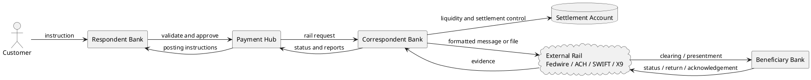

### 2. Fedwire ISO 20022 Sequence

Purpose: show message order for a high-value domestic wire.

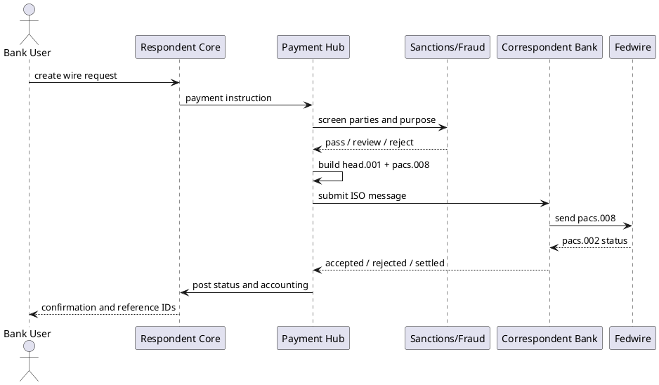

### 3. ISO Message Family Map

Purpose: make `pain`, `pacs`, `camt`, `head`, and `admi` memorable.

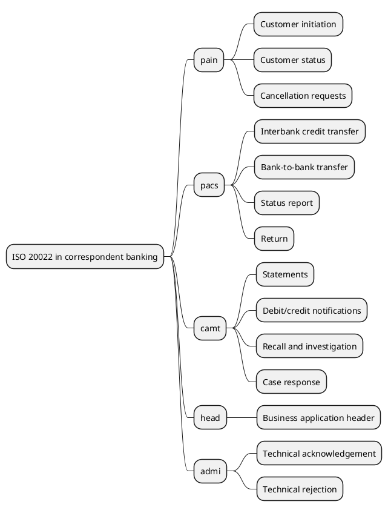

### 4. Status Lane State Machine

Purpose: show that one payment has many independent status tracks.

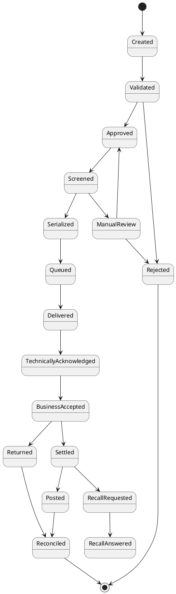

### 5. ACH File Structure

Purpose: explain Nacha batch anatomy.

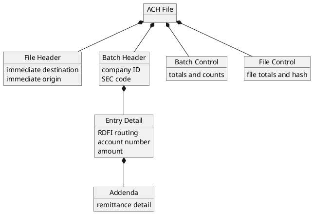

### 6. ACH Return Flow

Purpose: show why ACH exceptions often arrive later than origination.

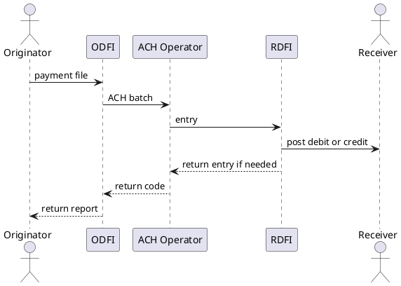

### 7. Check Image Presentment

Purpose: show capture through image cash letter and return handling.

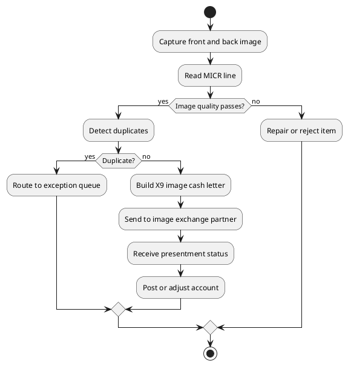

### 8. Exception And Investigation Loop

Purpose: show recall, response, return, and reconciliation around the original payment.

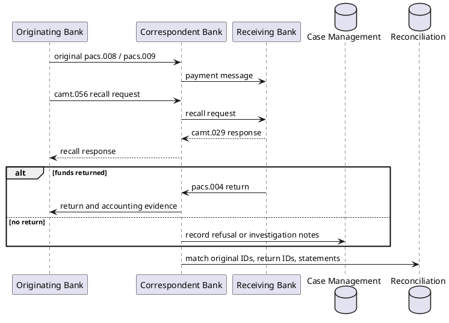

### 9. Liquidity And Settlement Controls

Purpose: show money movement vs messaging movement.

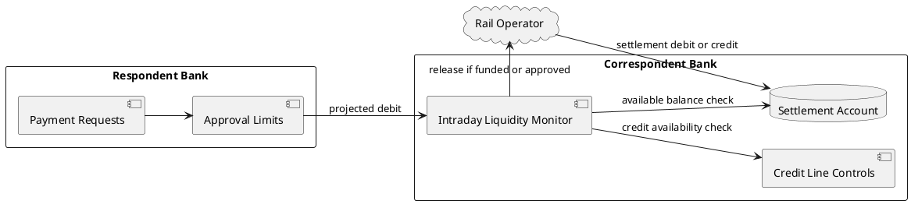

### 10. Reconciliation Evidence Model

Purpose: show what records must agree at the end of the day.

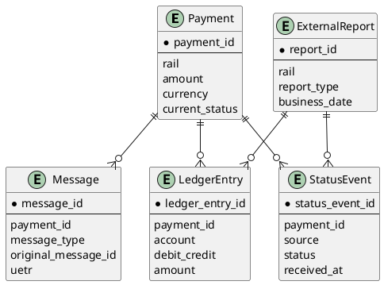

### 11. Fiserv-Style Platform Placement

Purpose: explain vendor layer without treating it as a payment standard.

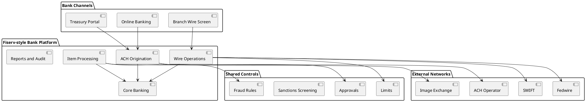

### 12. Daily Operations Close

Purpose: show how operations finishes a banking day.

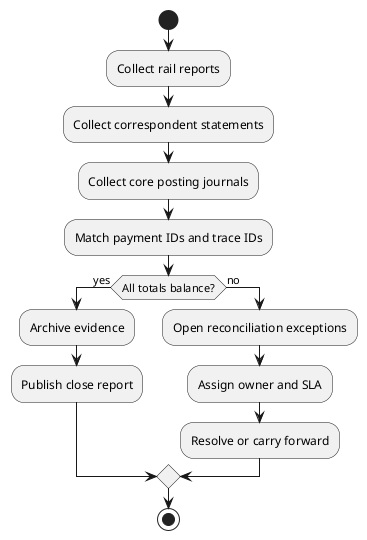

## Component Implementation Plan

### Step 1. Extract Route-Based Content

- Create `frontend/src/correspondent_banking/modules.js`.
- Move role, rail, standard, message-family, and field-note data out of `CorrespondentBankingGuide.jsx`.
- Add new content for ACH, checks, controls, reconciliation, and exceptions.
- Give every module a stable `path`.
- Keep content stateless. Do not add localStorage progress, completion state, quiz state, or flashcard state.

### Step 2. Add Server-Side PlantUML Rendering

- Create `api/src/services/plantuml.service.js`.
- Create `api/src/controllers/plantuml.controller.js`.
- Create `api/src/routes/plantuml.routes.js`.
- Create `api/src/data/correspondentBankingDiagrams.js` for allowlisted PlantUML source.
- Register the route from `api/src/routes/index.js`.
- Add `GET /api/plantuml/diagrams/:diagramId.svg`.
- Add `GET /api/plantuml/diagrams/:diagramId/source`.
- Use a configured PlantUML server URL with a safe default.
- Document the optional renderer URL in `api/.env-template` with an empty value, for example `PLANTUML_SERVER_URL=`.
- Keep diagram IDs allowlisted. Do not accept arbitrary user PlantUML in the guide endpoint.

### Step 3. Add Embedded PlantUML Component

- Create `frontend/src/components/plantuml/PlantUMLDiagram.jsx`.
- Fetch rendered SVG from `/api/plantuml/diagrams/:diagramId.svg`.
- Fetch source from `/api/plantuml/diagrams/:diagramId/source` only when the user copies or expands source.
- Keep the existing interactive PlantUML route unchanged.
- Add copy button and accessible title.

### Step 4. Add Diagram Content

- Create `frontend/src/correspondent_banking/diagrams.js`.
- Store client-visible diagram metadata.
- Store full PlantUML source in `api/src/data/correspondentBankingDiagrams.js`.
- Group diagrams by module.
- Make sure the API can access the same diagram definitions without importing frontend-only code. If sharing code between frontend and API becomes awkward, duplicate only the small diagram metadata client-side and keep PlantUML source server-side.

### Step 5. Rebuild Correspondent Banking Routes

- Keep `/correspondent-banking` as the index and table of contents.
- Add a route for every module listed in the proposed route map.
- Create `CorrespondentBankingModule.jsx` for rendering one module by route/module ID.
- Use React Router links for navigation.
- Add sticky route nav on desktop and compact route nav on mobile.
- Render relevant module tables, learning objectives, common mistakes, developer lens notes, and diagram panels.

### Step 6. Improve Diagram Gallery

- Update `CorrespondentBankingDiagrams.jsx` to render actual PlantUML diagrams.
- Add filter chips by type:
  - Relationship
  - Sequence
  - State
  - ACH
  - Checks
  - Controls
  - Reconciliation
- Keep modal behavior, but use the reusable `PlantUMLDiagram` component inside it.

### Step 7. Update Styles

- Update `banking-guide.css` for:
  - learning workspace layout
  - sticky nav
  - content panels
  - responsive module selector
  - denser tables
  - diagram frame sizing
- Update `banking-diagrams.css` for:
  - PlantUML gallery cards
  - modal diagram display
  - readable mobile behavior

### Step 8. Verify

Run:

```bash
npm run lint
npm run build
node --check api/src/services/plantuml.service.js
node --check api/src/controllers/plantuml.controller.js
node --check api/src/routes/plantuml.routes.js
```

Manual verification:

- Open `/correspondent-banking`.
- Open each module route directly.
- Check desktop and mobile layouts.
- Click every module nav route link.
- Open diagram gallery cards.
- Confirm PlantUML SVGs render through `/api/plantuml/diagrams/:diagramId.svg`.
- Confirm `/api/plantuml/diagrams/:diagramId/source` returns source without exposing any secrets.
- Confirm copy-source buttons work.
- Confirm text does not overflow compact cards, tables, tabs, or buttons.

## Suggested First Implementation Slice

To keep risk controlled, implement in this order:

1. Add `PlantUMLDiagram.jsx`.
2. Add Express PlantUML rendering route, controller, and service.
3. Add `correspondent_banking/diagrams.js` with 4 diagrams first:
   - Relationship map
   - Fedwire ISO sequence
   - ACH file structure
   - Check image presentment
4. Update `CorrespondentBankingDiagrams.jsx` to render PlantUML diagrams through the API.
5. Add the route-per-module structure.
6. Add the deeper ACH, check image, exception, controls, and reconciliation sections.
7. Add the remaining diagrams.

This keeps the first change useful without rewriting the whole page at once.

## Out Of Scope

- Quizzes.
- Flashcards.
- Learning progress tracking.
- LocalStorage-based completion state.
- User accounts or saved learning state.
- Arbitrary user-submitted PlantUML rendering from the guide.
